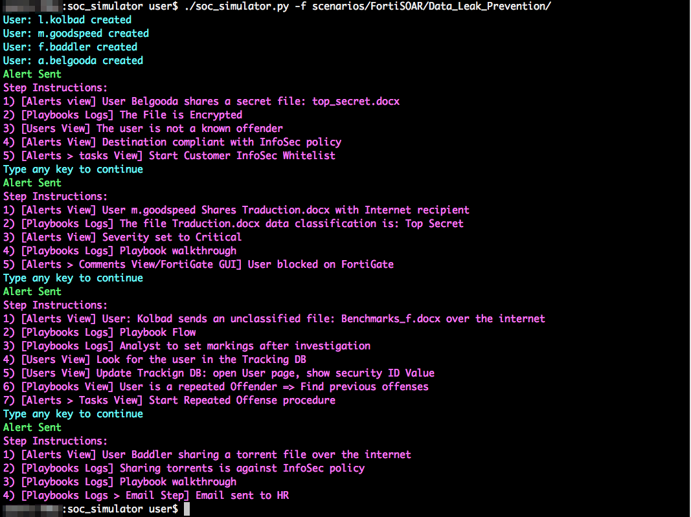

# (ftnt) SOC Simulator:

-- Work in Progress --

DISCLAIMER: without any warranty or liability for accuracy and completeness, no legal commitment is made or implied by the content of this repository

## Introduction:
A tool meant to be used during demos to simulate a SOAR/SIEM environment by sending a series of alerts/events with a specific timing according to a template. this creates a scenario to illustrate targeted FortiSOAR/FSM capabilities.
it is written in python so it can run on any machine with python installed including FortiSOAR/FSM. It simulates an Asset network connected to the Internet via FortiGate Firewall (FortiGate-Edge) and a set of alert sources including:
-FortiSIEM
-FortiAnalyzer
-MTA
-Others

A sample scenario run would look like:



The prerequisite will be executed first:
- Connectors verification, each required connector will be checked, it has to be installed, configured and set to Default.
- The associated playbooks will be uploaded to the FortiSIEM instance
- Users creation in FortiSOAR (optional)
- Syslogs sent to a SIEM server (optional)


The Environment requires a FortiGate to be used as a response enforcement point.
## How to use:
```
usage: ProgramName [-h] -f SCENARIO_FOLDER [-j STEP] [-t TENANT]

optional arguments:
  -h, --help            					: Shows this help message and exit
  -f SCENARIO_FOLDER, 	--scenario-folder 	: SCENARIO_FOLDER Scenario folder exp: ./scenarios/FortiSOAR/Comprmised_Web_Server/
  -j STEP, 				--step STEP 		: Run a specific step of the scenario and exit
  -t TENANT, 			--tenant TENANT 	: Tenant IRI
  -c CONFIG, 			--config CONFIG 	: Configuration file to use, by default config.json 

SOC Simulator: use config.json to configure FortiSIEM and FortiSOAR IPs and credentials depending on your environment
```
All parameters except: tenant, step and Scenario_folder are stored in a config.json file to avoid having to supply it as an cli argument. it's mandatory to edit config.json_sample and rename it to config.json before you start using the simulator.

Example:
```json
{
	"FORTISOAR_IP":"10.2.24.52",
	"fortisoar_username":"csadmin",
	"fortisoar_password":"changeme",
	"FORTISIEM_IP":"10.2.24.20",
	"fortisiem_username":"admin",
	"fortisiem_password":"admin*1",
	"sudo_password":"",
	"tenant":"",
	"TR_FG_MGMT_IP":"10.200.3.1",
	"TR_FG_DEV_NAME":"FortiGate-Edge",
	"TR_CUSTOMER_LAN":"10.200.3.0/24",
	"TR_FGT_SN": "FGXXXXXXXXXXXXXX",
	"GUI_mode": "local",
	"GUI_sshHost": "10.22.24.52",
	"GUI_sshPort": "20200",
	"GUI_sshUser": "admin",
	"GUI_sshPass": "admin*1"
}
```
TR_* are environment constant attributes to be used in the scenarios, see scenario.json section below

## Components:

- Main script: The main cli
- Modules Directory: Contain various functions libraries
- Templates Directory: Contains the available templates to be used during the demo, each template file represents a scenario around a specific product (FortiSOAR/FortiSIEM). it is a list of dictionary objects.
- SOCSIM_Daemon: implementing functions which require root privileges such as sending spoofed syslogs to FortiSIEM

### FortiSOAR Templates:
Each scenario template is a folder containing:
Scenario_Name.pptx 	: A power-point describing the scenario
info.json 			: Scenario meta data
infocgraphics.gif 	: Scenario diagram
playbooks.json 		: The FortiSOAR playbook collection containing the required playbooks for the scenario, this collection will be pushed to FortiSOAR at run time.
scenario.json 		: The list of Alerts to be send with their timing/transition configuration

#### info.json
It contains the scenario meta data and dependencies, this file is first read and used in the scenario initiation

| Config attribute | description|
|---|---|
|name | Scneario Descriptive Name, (usualy the same as the folder name where the scenario files are stored)|
| product | fortisoar, fortisiem, This is for the simulator to identify the target product|
| connectors_dependencies| [name_of_the_connectors,] FortiSOAR connector name which must be configured and set to default before running the scneario|
|version | version of the scenario |
|description | high level scenario description|
|category | audience type: analysts, C level...etc|
|publisher | scenario owner|
|infographic | link to the infographic file|
|connectors_dependencies| a list of required connectors for the scenario, exp:["whois-rdap","virustotal"]|
|fsm_events_dependencies|a list of events to be sent to a SIEM before the scenario starts, check syntax below|
|fsr_user_dependencies|a list of users FortiSOAR will use during the playbooks execution, each user will have a tag 'offender' and a security ID of :10 if it contains the word: bad (such as r.baddler)|


Example:
```json
{
    "name": "Compromised Web Server Scenario",
    "product":"fortisoar",
    "category":"soc_analyst",
    "fsr_user_dependencies":["m.goodspeed","f.waldo"],    
    "connectors_dependencies":["whois-rdap","virustotal","fortigate-firewall","fortinet-fortisiem","ssh"],
    "fsm_events_dependencies":[
        {"source_ip":"10.0.50.120","destination_ip":"10.0.1.5","payload":"<142>May 17 13:27:37 fortielab.com ApacheLog  10.0.50.120 - Aule [17/Jul/2020:12:11:52 +0000] \"GET /html/index.php HTTP/1.1\" 200 431\"http://www.fortielab.com/\" \"Mozilla/4.05 [en] (MacOSX; I)\" \"USERID=Windows;IMPID=01234\""},
        {"source_ip":"10.0.50.150","destination_ip":"10.0.1.5","payload":"<142>May 17 13:27:37 fortielab.com ApacheLog  10.0.50.150 - Aule [17/Jul/2020:12:11:52 +0000] \"GET /html/index.php HTTP/1.1\" 200 431\"http://www.fortielab.com/\" \"Mozilla/4.05 [en] (MacOSX; I)\" \"USERID=Windows;IMPID=01234\""}
    ],
    "version": "1.0.0",
    "description": "A Web Server is Compromised, its index.htm overridden with a malicious URL redirect",
    "category": "soc_analyst",
    "publisher": "CSE-Team",
    "infographic": "https://github.com/ftnt-cse/soc_simulator/raw/master/scenarios/FSOAR/Comprmised_Web_Server/infographics.gif"
}
```


#### playbooks.json
Typically the playbook collection is created while developing the scenario on FortiSOAR, once completed it has to be exported as playbooks.json so the simulator can upload it to the FortiSOAR instance where it runs. To make sure the playbooks within this collection are only triggered for the scenario alerts the 'source' value of the scneario.json template file has to be used as a filter all playbooks.json collection playbooks. 

#### scenario.json
A sample template structure:
```json
[
{
"data":[
		{
		"sleep":-1,
		"name": "Traffic to FortiGuard Malware IP List",
		"source":"FSM-INTL-DEMO",
		"sourcedata":{
			 	"incident": {
						"id": 8119518313,
						"xmlId": "Incident@000000000",
						"ruleDesc": "Detects network traffic to FortiGuard Blocked IP List",
						"ruleName": "Traffic to FortiGuard Malware IP List",
						"severity": 9,
						"origDevIp": "{{TR_FG_MGMT_IP}}",
						"srcIpAddr": "{{TR_ASSET_IP}}1",
						"cacheIndex": "<phCustId>2002</phCustId>",
						"destIpAddr": "{{TR_MALICIOUS_IP}}",
						"externalId": 8179,
						"incidentEt": "PH_RULE_TO_FORTIGUARD_MALWARE_IP",
						"origDevName": "{{TR_FG_DEV_NAME}}",
						"severityCat": "HIGH",
						"creationTime": "{{TR_NOW}}",
						"deviceStatus": "Pending",
						"lastModified": "{{TR_NOW}}",
						"lastSeenTime": "{{TR_NOW}}",
						"ticketStatus": "None",
						"firstSeenTime": "{{TR_PAST}}",
						"incidentCount": "{{TR_RANDOM_INTEGER}}",
						"incidentTarget": "destIpAddr:,",
						"incidentCategory": "Security/Command and Control",
						"phIncidentCategory": "Network",
						}
				}
		}
	]
},
{
"data":[
		{
		"sleep":0,
		"name": "Traffic to FortiGuard Malware IP List",
		"source":"FSM-INTL-DEMO",
		"sourcedata":{
			 	"incident": {
						"id": 8119518313,
						"xmlId": "Incident@000000000",
						"ruleDesc": "Detects network traffic to FortiGuard Blocked IP List",
						"ruleName": "Traffic to FortiGuard Malware IP List",
						"severity": 9,
						"origDevIp": "{{TR_FG_MGMT_IP}}",
						"srcIpAddr": "{{TR_ASSET_IP}}2",
						"cacheIndex": "<phCustId>2002</phCustId>",
						"destIpAddr": "{{TR_MALICIOUS_IP}}",
						"externalId": 8179,
						"incidentEt": "PH_RULE_TO_FORTIGUARD_MALWARE_IP",
						"origDevName": "{{TR_FG_DEV_NAME}}",
						"severityCat": "HIGH",
						"creationTime": "{{TR_NOW}}",
						"deviceStatus": "Pending",
						"lastModified": "{{TR_NOW}}",
						"lastSeenTime": "{{TR_NOW}}",
						"ticketStatus": "None",
						"firstSeenTime": "{{TR_PAST}}",
						"incidentCount": "{{TR_RANDOM_INTEGER}}",
						"incidentTarget": "destIpAddr:,",
						"incidentCategory": "Security/Command and Control",
						"phIncidentCategory": "Network",
						}
				}
		}
	]
}
]
```
- __"sleep":__ can take the values : 
- 0 => the alert will be sent immediately 
- a negative integer => The user will be prompted to press any key to send the alert and continue to the next one
- a positive integer => would indicate the number of seconds to wait before sending the current alert

 Template file contains the static text as sent from the alert source device and a set of variables delimited with {{}}.

All variables will be replaced with their dynamic value at runtime. when a list of alerts is present within the same template you can manipulate variable values by statically concatenating values, example : 

If {{TR_ASSET_IP}} is present in both alerts of the same template it's possible to set the first as: {{TR_ASSET_IP}}1 and {{TR_ASSET_IP}}2 in the second, so the sent alert will have 2 values of {{TR_ASSET_IP}}

The list of available dynamic values (Variables):

|"VARIABLE"|function name|use case|
|:----------|:-------------|:-------------|
|"TR_X_MIN_AGO"|get_time_x_min_ago| returns a timestamp of X minutes ago, minutes parameter is added as a CSV, example: to set time to 40 min ago, use the syntax: {{TR_X_MIN_AGO,40}}|
|"TR_FORMATTED_CURRENT_TIME"|get_formatted_current_time|returns the current time formatted as in: Sun, 14 Jan 2020 19:46:35|
|"TR_FG_MGMT_IP"|get_fg_mgmt_ip|get fortigate mgmt IP (according to the topology file)|
|"TR_FG_DEV_NAME"|get_fg_dev_name|get fortigate device name (according to the topology file)|
|"TR_ASSET_IP"|get_asset_ip| get a random local IP from the prefix: 10.200.3.2-25, to specify another range (30 to 99 for example) use the syntax: {{TR_ASSET_IP,30,99}}|
|"TR_MALICIOUS_IP"|get_malicious_ip| get a malicious IP from CTI|
|"TR_NOW"|get_time_now|get current timestamp|
|"TR_RANDOM_INTEGER"|get_random_integer|get random number between 55555 and 99999 if used without parameters, to specify the range from 1 to 100 use the syntax: {{TR_RANDOM_INTEGER,1,100}}|
|"TR_MALICIOUS_DOMAIN"|get_malicious_domains| get a malicious domain name from CTI|
|"TR_MALICIOUS_URL"|get_malicious_url|get a malicious url from CTI|
|"TR_MALICIOUS_HASH"|get_malware_hash|get malicious hash from CTI|
|"TR_PUBLIC_IP"|get_my_public_ip|get your public IP address|
|"TR_PAST"|get_time_past |up to a couple of days ago|
|"TR_T-1"|get_time_minus_one |get timestamp of about one hour ago|
|"TR_T-2"|get_time_minus_two |get timestamp of about two hours ago|
|"TR_T-3"|get_time_minus_tree|get timestamp of about three hours ago|
|"TR_T-4"|get_time_minus_four|get timestamp of about four hours ago|
|"TR_T-5"|get_time_minus_five|get timestamp of about five hours ago|
|"TR_T-6"|get_time_minus_six |get timestamp of about six hours ago)
|"TR_USERNAME"|get_username|a random username|
|"TR_MALICIOUS_FILE"|get_malicious_file|Crafts a malicious zero day base64 encoded pdf|
|"TR_MALICIOUS_FILE_MD5"|get_malicious_file_md5|if TR_MALICIOUS_FILE exists, returns its md5|
|"TR_MALICIOUS_FILE_SHA1"|get_malicious_file_sha1|if TR_MALICIOUS_FILE exists, returns its sha1|
|"TR_MALICIOUS_FILE_SHA256"|get_malicious_file_sha256|if TR_MALICIOUS_FILE exists, returns its sha256|
|"TR_FGT_SN"|get_fgt_sn|returns FortiGate serial number from the config file|
|"TR_DATE_NOW_ONLY"|get_date_now_only| returns current date|
|"TR_TIME_NOW_ONLY"|get_time_now_only| returns current time|
|"TR_TIMEZONE"|get_timezone| returns timezone from config file|


### FortiSIEM Templates:
Each scenario template is a folder containing:
Scenario_Name.pptx 	: A power-point describing the scenario
info.json 			: Scenario meta data
infocgraphics.gif 	: Scenario diagram
scenario.json 		: The list of events to be sent to FortiSIEM
#### scenario.json
A sample template structure:
```json
[
  {
    "sleep": 0,
    "source_ip": "10.10.11.204",
    "destination_ip": "",
    "payload": "<185>date=2020-05-16 time=16:24:41 devname=\"FortiGate-Core\" devid=\"FGVM02TM19000000\" logid=\"0419016384\" type=\"utm\" subtype=\"ips\" eventtype=\"signature\" level=\"alert\" vd=\"root\" eventtime=1589639081585852711 tz=\"+0200\" severity=\"high\" srcip={{TR_MALICIOUS_IP}} srccountry=\"Reserved\" dstip={{TR_ASSET_IP}} srcintf=\"port5\" srcintfrole=\"wan\" dstintf=\"port2\" dstintfrole=\"dmz\" sessionid=1148457 action=\"detected\" proto=6 service=\"HTTP\" policyid=4 attack=\"PhpMoAdmin.moadmin.php.Unauthenticated.Remote.Code.Execution\" srcport=52848 dstport=80 hostname=\"{{TR_ASSET_IP}}\" url=\"/dvwa/moadmin/moadmin.php?collection=secpulse&action=listRows&find=array();phpinfo();exit;\" direction=\"outgoing\" attackid=40243 profile=\"protect_http_server\" ref=\"http://www.fortinet.com/ids/VID40243\" incidentserialno=7828925 msg=\"web_app: PhpMoAdmin.moadmin.php.Unauthenticated.Remote.Code.Execution,\" crscore=30 craction=8192 crlevel=\"high\""
  },
  {
    "sleep": 0,
    "source_ip": "10.10.11.204",
    "destination_ip": "",
    "payload": "{{TR_ASSET_IP}}1 - - [12/May/2020:15:58:07 +0200] \"GET /dvwa/moadmin/moadmin.php HTTP/1.1\" 200 1049 \"-\" \"Mozilla/5.0 (Macintosh; Intel Mac OS X 10_13_6) AppleWebKit/537.36 (KHTML, like Gecko) Chrome/81.0.4044.138 Safari/537.36\""
  }
]
```
- When destination_ip is empty, the event will be sent to the configured FORTISIEM_IP in the global congig.json
- Sleep, determines how many seconds to wait before sending the next event.

### SOCSIM_Daemon:
If the scenario includes events to be sent via syslog to FortiSIEM and soc_simulator is running with unprivileged user, the configuration parameter : sudo_password located at config.json will be used to run socsim_dameon.py as root. soc_simulator will then use it to send syslogs via a named pipe.
If soc_simulator is run as root, events are sent directly.


### License
GPL3.0
