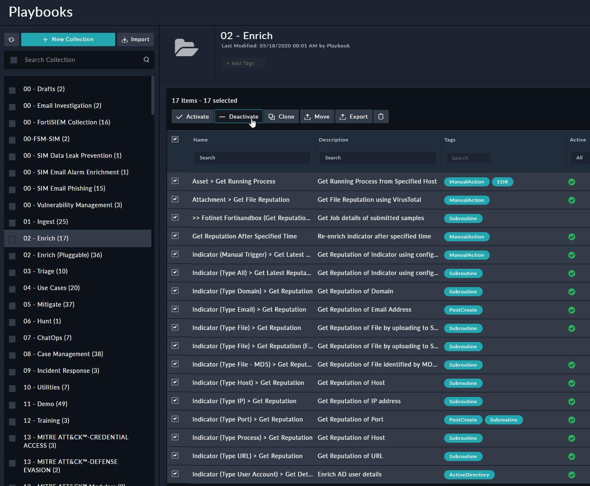

# Overview
Phishing scenarios are one the most requested demos with FortiSAOR, this HowTo document will help you perform a comprehensive Phishing Email one.

# Prerequisites:

-  A running FortiSOAR 6.4.4+ installation
-  An Installed content pack
-  A configured Code Snippet connector
-  For a more realistic scenario, a working Exchange server (Optional)

# Installation
Download the soc_simulator to your FortiSOAR VM (or any box with Python3) and install it with the following commands:
```bash
sudo bash
wget https://github.com/ftnt-cse/soc_simulator/archive/master.zip -O soc_simulator.zip && unzip soc_simulator.zip && rm -f soc_simulator.zip
cd soc_simulator-master
chmod +x soc_simulator.py
sudo pip3 install -r requirements.txt
```
To configure soc_simulator use the below instructions (Only required if your FortiSOAR has none-default credentials):

-  vi config.json and update FortiSOAR IP and credentials with the ones from your environment

# Environment requirements

-  Download MITRE Att&ck Techniques
	- Browse to : Automation > Playbooks > 13 - MITRE ATT&CK™-Pull-Technique-Details > Download Mitre Techniques
	- Click on the trigger button ► ( it may take time)
- Deactivate the default enrichment playbook (or set a "Generic" tag as a triggering condition)
    - Browse to : Automation > Playbooks > 02 - Enrich
    - Select all playbooks except [Indicator (Type Host) > Get Reputation] in the collection and click Deactivate 



# Run the demo
    - Modify the default config if required (if soc_simulator is installed on FortiSOAR and you haven't changed the default username/password you don't need to change anything):
```json
{
        "FORTISOAR_IP":"127.0.0.1",
        "fortisoar_username":"csadmin",
        "fortisoar_password":"changeme",
        "random":"yes",
        "tenant":"",
        "TR_FG_MGMT_IP":"10.200.3.1",
        "TR_FG_DEV_NAME":"FortiGate-Edge",
        "FGT_SN": "FGXXXXXXXXXXXXXX",
        "TR_CUSTOMER_LAN":"10.200.3.0/24"
}
```
    - ```./soc_simulator.py -f scenarios/FortiSOAR/Advanced_Phishing_Email/ ```