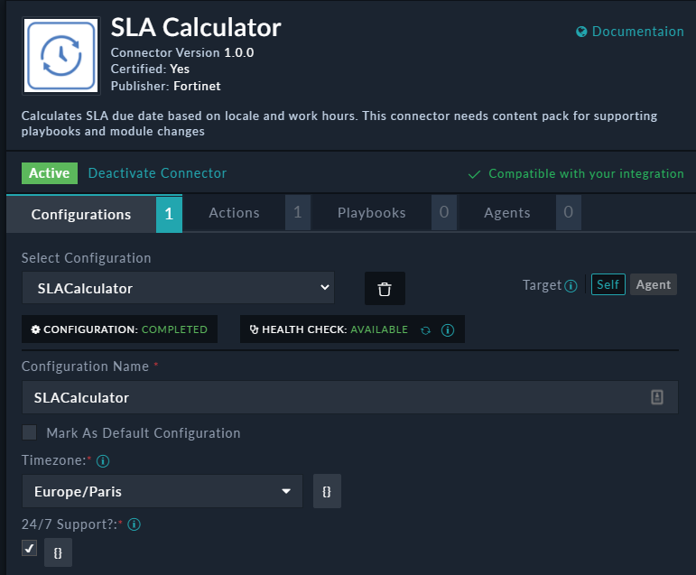
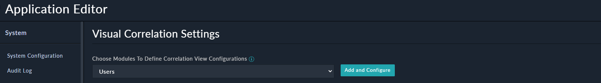
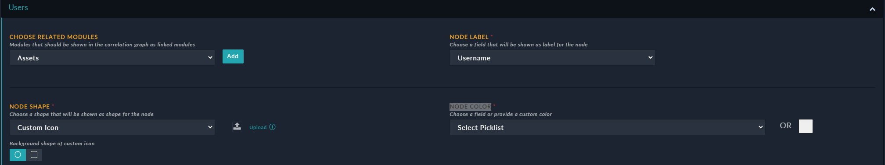
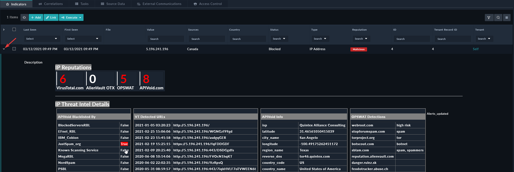
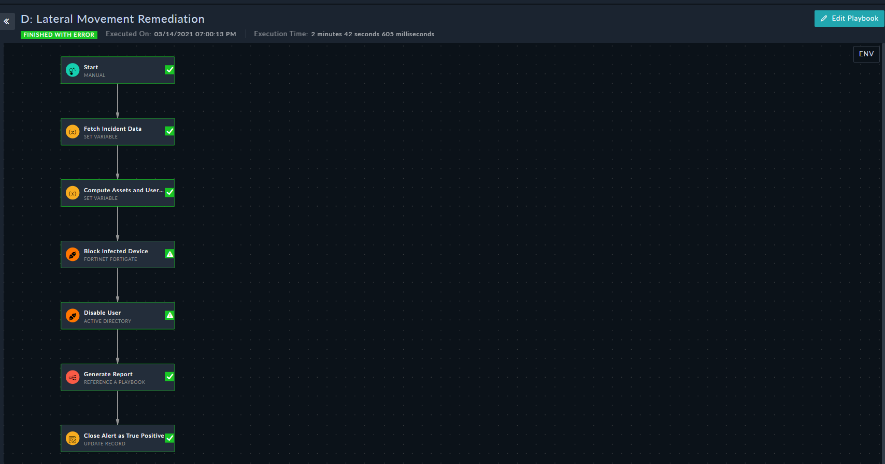

# Overview
This scenario is a bout a malware infection spreading laterally, FortiSOAR is used to investigate and remediate the incident.

# Prerequisites:

- A running FortiSOAR 6.4.4+ installation
- An Installed content pack
- Configure SLA Calculator Connector



- For a more realistic scenario, a working FortiGate and an AD server (Optional)

# Installation
Download the soc_simulator to your FortiSOAR VM (or any box with Python3) and install it with the following commands:
```bash
sudo bash
wget https://github.com/ftnt-cse/soc_simulator/archive/master.zip -O soc_simulator.zip && unzip soc_simulator.zip && rm -f soc_simulator.zip
cd soc_simulator-master
chmod +x soc_simulator.py
sudo pip3 install -r requirements.txt
```
To configure soc_simulator use the below instructions (Only required if your FortiSOAR has none-default credentials):

-  vi config.json and update FortiSOAR IP and credentials with the ones from your environment

# Environment requirements

-  Configure users in the correlation widget
	- Browse to : settings > Correlation settings > Select Users and click Add and Configure



	- Configure it with:
        - CHOOSE RELATED MODULES : Assets
        - NODE LABEL: Username
        - NODE SHAPE: Custom Icon: upload the icon from media/user.png (or any other of your choice)
        - NODE COLOR: White
    - Save    



# Run the demo
    - Modify the default config (config.json) if required (if soc_simulator is installed on FortiSOAR and you haven't changed the default username/password you don't need to change anything):
    - Run the demo:
```bash
./soc_simulator.py -f scenarios/FortiSOAR/Malware_Lateral_Movement/ 
```

# Demo script:
## Alert 1: Traffic to FortiGuard Malware IP List-XXXXX1
- SIEM detects a C2 Connection and forwards it to SOAR
- Incident Response > Alerts > Traffic to FortiGuard Malware IP List-XXXXX1
- Alert Description: infected Asset: Source IP, user, C2 IP
- Alert Details: Alert Escalated with the reason in the description [ Malicious Indicator ]
- Indicators > Expand the indicator details
    - Review various CTI reputation and threat intelligence details



- Correlations: An infected asset with belonging to 'user'
    - User
    - Asset
    - Escalated Incident
- Workspace > Comments: tracking both automated and analyst written comments
- Correlations > Incident
    - Alert data copied to Incident (Description, Correlations and comments)
    - Graphical Correlation
- Incident Response:
    - Browse to: Tasks > Assign Investigate and Remediate Incident
        - Note the required tasks
    - Execute > D: Lateral Movement Remediation
    - Open the Playbook logs: 
    - Walk through the remediation playbook execution (self explanatory steps)
    


- Incident > Comments > Open the newly generated PDF report and walk through it