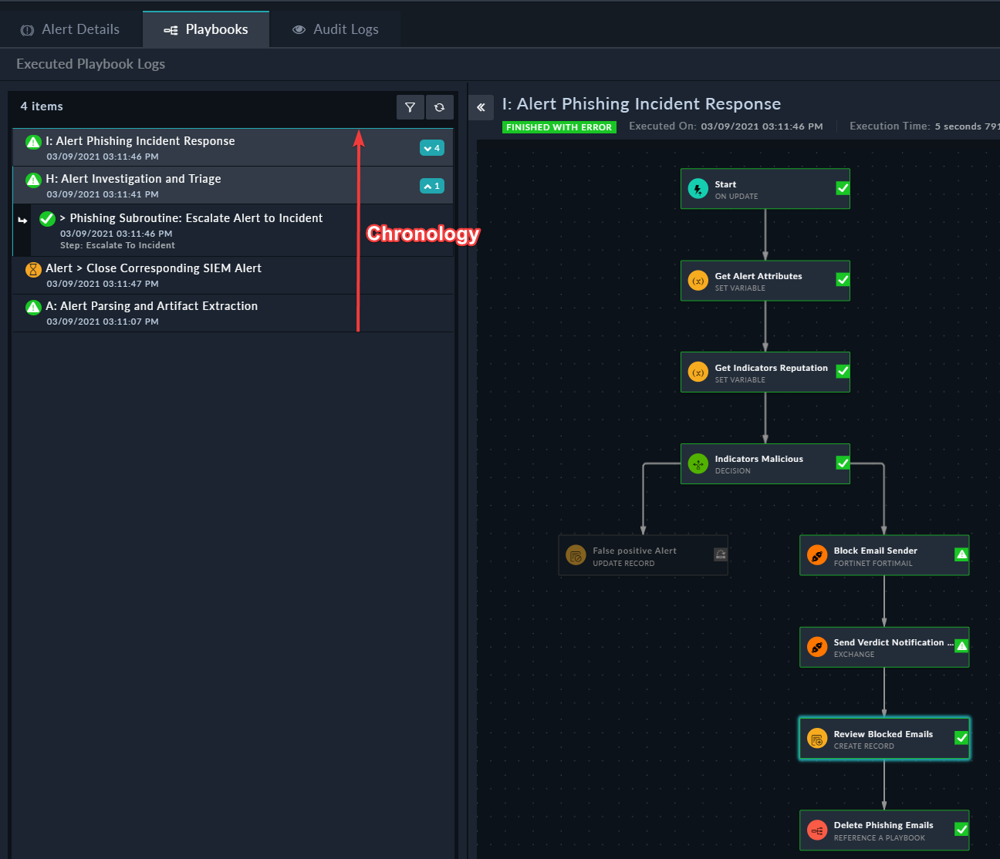
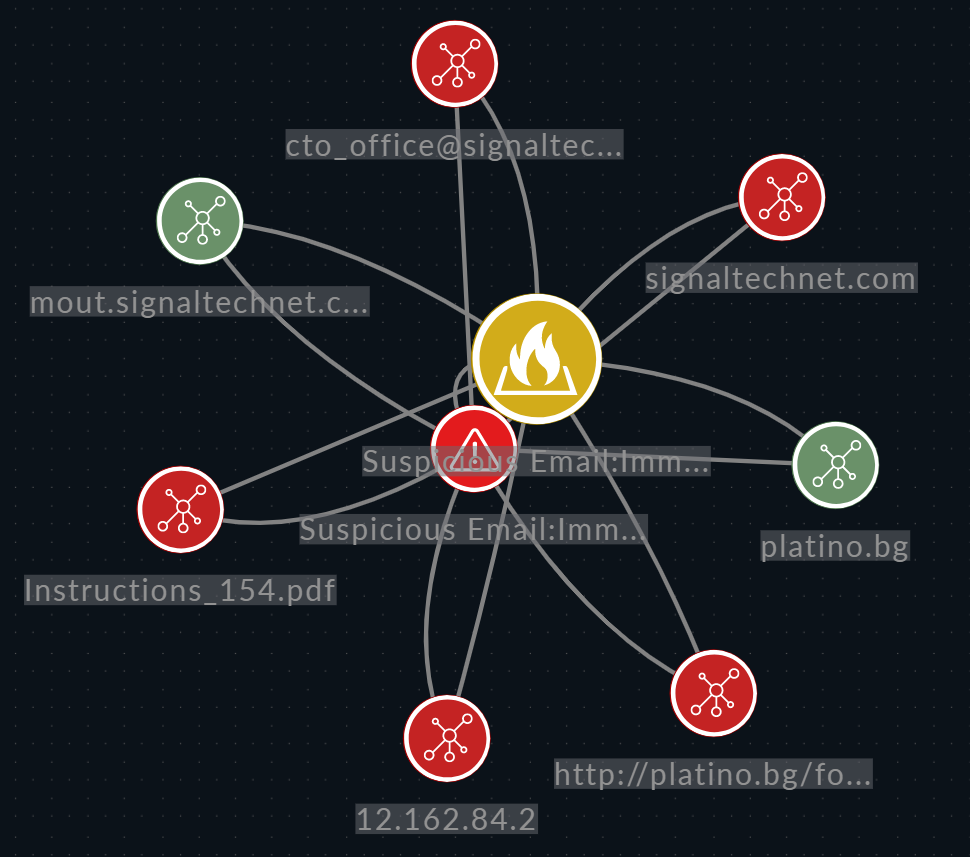

# Overview
Phishing scenarios are one the most requested demos with FortiSAOR, this HowTo document will help you perform a comprehensive Phishing Email one.

# Prerequisites:

-  A running FortiSOAR 6.4.4+ installation
-  An Installed content pack
-  A configured Code Snippet connector
-  For a more realistic scenario, a working Exchange server with fortielab.com domain and all the users used in this scenario (Optional)

# Installation
Download the soc_simulator to your FortiSOAR VM (or any box with Python3) and install it with the following commands:
```bash
sudo bash
wget https://github.com/ftnt-cse/soc_simulator/archive/master.zip -O soc_simulator.zip && unzip soc_simulator.zip && rm -f soc_simulator.zip
cd soc_simulator-master
chmod +x soc_simulator.py
sudo pip3 install -r requirements.txt
```
To configure soc_simulator use the below instructions (Only required if your FortiSOAR has none-default credentials):

-  vi config.json and update FortiSOAR IP and credentials with the ones from your environment

# Environment requirements

-  Download MITRE Att&ck Techniques
	- Browse to : Automation > Playbooks > 13 - MITRE ATT&CK™-Pull-Technique-Details > Download Mitre Techniques
	- Click on the trigger button ► ( it may take time)
    - Alternatively import the **Playbook_collection_Mitre_Local_Import.json** collection from the scenario folder and run **A: Download Mitre Techniques** playbook manually, it may take some time due to network and device performance.
- Deactivate the default enrichment playbook (or set a "Generic" tag as a triggering condition)
    - Browse to : Automation > Playbooks > 02 - Enrich
    - Select all playbooks except [Indicator (Type Host) > Get Reputation] in the collection and click Deactivate 


# Run the demo
    - Modify the default config (config.json) if required (if soc_simulator is installed on FortiSOAR and you haven't changed the default username/password you don't need to change anything):
    - Run the demo:
```bash
./soc_simulator.py -f scenarios/FortiSOAR/Advanced_Phishing_Email/ 
```

# Demo script:
## Alert 1: False positive
- (If an Exchange server is present): Open asmith@fortielab.com inbox and show both the suspected email and the acknowledgment email from SOAR stating the email has been received for investigation
- A user suspects a legitimate email to be malicious
- Incident Response > Alerts > Suspicious Email:Immediate action required (Minimal)
- FortiSOAR doesn't find any indicators
- The Alert is closed as a false positive since it's an internal email
- Check Closure Note

## Alert 2: True Phishing Email
- Incident Response > Alerts > Suspicious Email:Immediate action required (Critical)
- Alert Description: Alert Summary
- Alert Description: MITRE ATT&CK technique descriptions, more details => Correlations tab > ATTACK Technique > right click > Open in new tab


- Details: 
    - Assigned to
    - Status
    - Kill Chain phase
    - Escalated: due to malicious indicators

- Review the reporter email body (the text the user forwarding the email wrote)
- Review the phishing email body and header
- Indicators: expand each indicator highlighting the rating and threat intelligence details in the description 


- Correlations: Describe each related object
- Playbooks: Review the playbooks chronology (Bottom up)
    - A: Alert Parsing and Artifact Extraction:
        - Email Parsing     
        - Attachment creation and submission to Sandbox
        - Indicator extraction and whitelisting
        - Create new indicators and link existing ones
    - H: Alert Investigation and Triage:
        - If an indicator or more are malicious: Escalate the alert to incident and notify the reporter
        - Else: close the alert as false positive
    - I: Alert Phishing Incident Response:
        - (If an Exchange server is present): Open asmith@fortielab.com inbox show how the malicious email was deleted and the user received a verdict and remediation notification from SOAR stating the email is malicious and it will be deleted from mailbox
        - If the Alert is escalated:
            - Block the Phishing email sender on FortiMail
            - Notify reporter
            - Connect to each recipient mailbox and delete the malicious email



- Audit Logs: quick description 
- Correlations > Incidents : Open the escalated Incident
    - All Alert content has been copied
    - Describe the graphical correlation
    - Browse to Tasks: Open Assign Investigate and Remediate Incident task and describe the content
    - Mark the task as completed
    - Change the incident severity to Critical
    - change phase to "Aftermath"
    - Change status: Resolved 
    - Fill: Incident Summary, next Step, Resolution and click Update




A sample demo of this scenario is available [here](https://www.youtube.com/watch?v=vuiDVAXjIEA)
